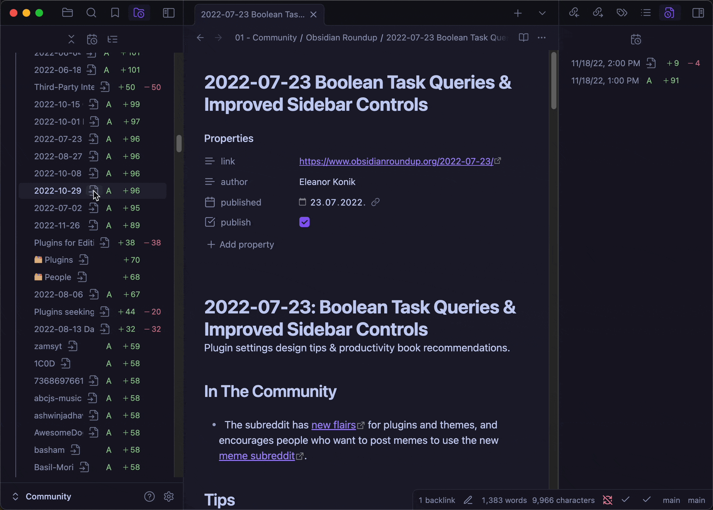
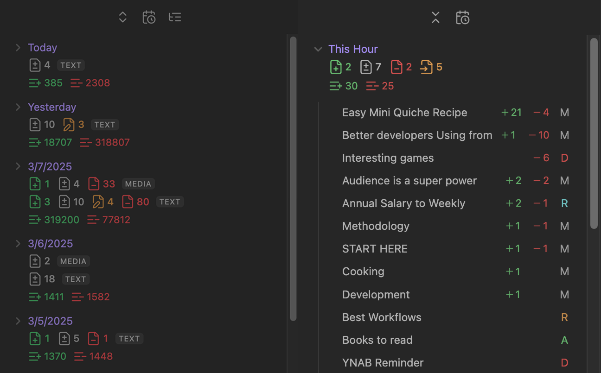
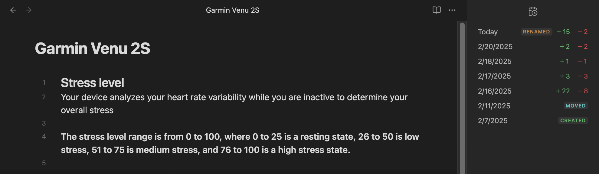
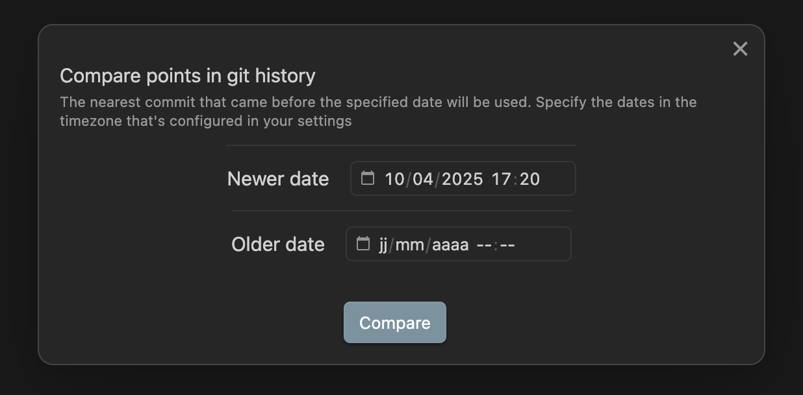
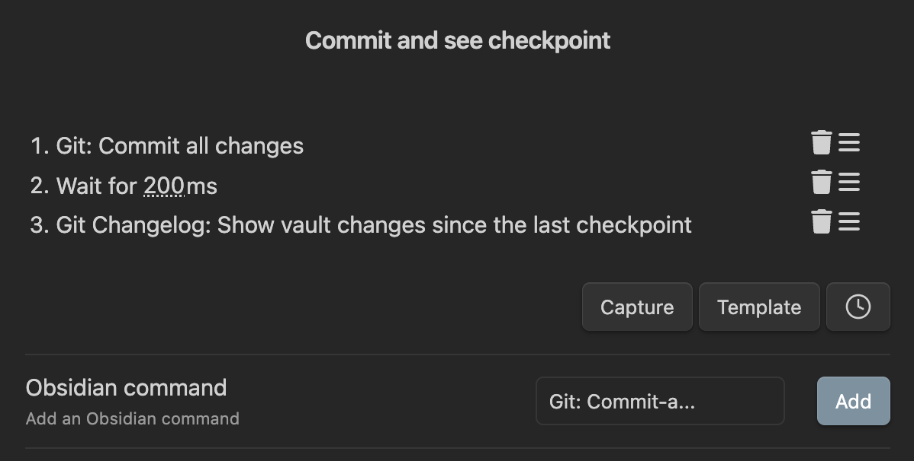

# Git Changelog

An [Obsidian](https://obsidian.md) plugin that utilizes Git commit history to display dynamic changelogs in your sidebar. Also usable as a practical data loss monitoring tool.

> [!NOTE]
> January 2026 update: I didn't forget about this plugin, I'm just busy with other stuff currently. I plan to continue working on it when I get the time.
> If in the meantime a change happens in Obsidian or the Git plugin that breaks this plugin, I'll fix it.



## Table of Contents

- [Installation](#installation)
- [Features](#features)
  - [Vault Changelog View](#vault-changelog-view)
  - [File Changelog View](#file-changelog-view)
  - [Changelog Customizability](#changelog-customizability)
  - [Live Stats in the Status Bar for the Current Note](#live-stats-in-the-status-bar-for-the-current-note)
  - [Integration with Git Plugin's Diff View](#integration-with-git-plugins-diff-view)
  - [Compare Two Vault States in History](#compare-two-vault-states-in-history)
  - [Show Vault Changes since the Last Checkpoint](#show-vault-changes-since-the-last-checkpoint)
- [Data Loss Monitoring](#data-loss-monitoring)
  - [Common Causes of Data Loss](#common-causes-of-data-loss)
  - [How to Use](#how-to-use)
- [Limitations](#limitations)
- [Roadmap](#roadmap)
- [Alternatives](#alternatives)
- [FAQ](#faq)
- [Debugging](#debugging)
- [Contributing](#contributing)
- [Credits](#credits)

## Installation

[Download](https://obsidian.md/plugins?id=git-changelog) the plugin from the official Community Plugins repository.

> [!IMPORTANT]
> Requires the [Git plugin](https://github.com/Vinzent03/obsidian-git) to be installed. Installing it and maintaining a Git repository can be beneficial, even if you rely on other syncing services.

> [!NOTE]
> This plugin is currently in beta and still under development, so your existing settings may break after each update. If some saved settings were broken, they will be mentioned in the changelog.

## Features

To easily see the what's new in future updates, it's recommended to use the [Plugin Update Tracker](https://obsidian.md/plugins?id=obsidian-plugin-update-tracker).

### Vault Changelog View



- Detects renamed and moved files separately.
- Shows the total count of lines added and deleted.
- Displays counts of files added, modified, moved/renamed and deleted (total or text and non-text separately). **NOTE:** If a file is both renamed/moved and modified, it will contribute towards the renamed/moved files stats.
- Lists per file lines added and deleted, along with additional file statuses (**A**dded, **R**enamed, **M**oved, or **D**eleted).
  - The files are sorted from most number of lines changed to least.
- **Exclude Files and Folders:**

  - Usually you specify files and folders you want to exclude from your Git repository in the `.gitignore` file.

    Example of suggested items to put in `.gitignore` include OS specific files like `.DS_Store`, `.obsidian/workspace.json` and other plugins' cache files that constantly change and trigger commits even when no changes were made to the vault. These files usually don't hold any important user data and are regenerated easily (in case of needing to restore the vault from a backup).

    But this setting is useful if you want to keep some files backed up by your repository (e.g. because they're valuable), but exclude them from appearing in the vault changelog.

    Common examples for this: `/.trash`, `/attachments` and `/.obsidian` folders, debug/log files, or conflict files generated by a syncing service that can clutter the changelog stats.

    Also use this setting to filter files and folders that already exist in previous commits, since specifying files in .gitignore doesn't remove them from previous commits.

  - **Context menu integration:** To exclude a file or folder, just right-click on it inside the File explorer and select "Git changelog: Exclude" from the context menu, no need to manually define paths.

  - For advanced users: If you configured your Git repository to be below the vault root directory, the paths should be relative to the Git repo, not the vault.

- **Include items instead:**

  - Convert the `Exclude Files and Folders` list to an include list, while excluding everything else.

  - An example case where this can come in handy is when you notice your vault misbehaving, you can trigger this setting and put `.obsidian` in the list to exclusively see changes made inside your configuration folder.

    Then you can easily investigate what settings recently changed and if some of the changes are the cause of your issue.

### File Changelog View



- Shows the count of added and deleted lines for all previous versions of the active note.

> [!WARNING]
> Showing a lot of versions and files will reduce view performance. This will be fixed soon.

### Changelog Customizability

- Set a custom day start time (if you're a night owl and want to track your actual days).
- Set a custom timezone to base the intervals on or detect it automatically.
- Easily switch between hourly, daily, weekly, and monthly intervals.
- Choose from 5 options to ignore whitespace changes with varying intensity.
- **Adjust file rename detection strictness:**

  - Git can't actually track which files you renamed. Instead, it tries to detect renames by comparing the file contents of the old and new files.

    It can falsely mark new files as some old file getting renamed, and it can miss actual renames and mark them as separate files getting deleted and created.

  - Higher strictness results in detecting less renames.

### Live Stats in the Status Bar for the Current Note

- Set any interval for the status bar stats. Setting a frequent auto-commit interval in the [Git plugin's](https://github.com/Vinzent03/obsidian-git) settings will also allow for a more frequent status bar interval. But this interval shouldn't be more frequent than the auto-commit interval in order to maintain accuracy.

### Integration with Git Plugin's Diff View

- Click on any file version in the changelog views to open the corresponding diff view showing the changes.

> [!WARNING]
> Currently, only the "Split" diff view works. The "Unified" view shows inaccurate changes.

### Compare Two Vault States in History

- Use the `Compare two vault states in history` command to compare any two points in the vault's Git history.

- All settings that apply to the changelog views also apply to this command.

  

### Show Vault Changes since the Last Checkpoint

- The easiest way to track all changes made to your vault over time is to use the `Show vault changes since the last checkpoint` command to open a temporary view that shows all changes that happened since the last checkpoint (meaning: the last time you ran this command and approved the shown changes by creating a new checkpoint).

- If you're someone who's always concerned about data integrity, you don't need to have the vault changelog view open all the time in order to track changes. 😁 Just run this command every now and then to inspect all changes made since the last time you checked. (Be it a few minutes ago or a few months.)

- Optionally receive a notification at a recurring set interval (in minutes) that reminds you to review the changes made since the last checkpoint.

- If you don't like that this command is using the latest commit as the comparison point instead of the live vault state:

  - You can create an action (macro) using the [QuickAdd](https://obsidian.md/plugins?id=quickadd) plugin that will:
    1. Run the "Commit-and-sync" or "Commit" command, depending on if you use Github to sync or not (these commands are available through the Git plugin).
    2. Wait for some time for the commit to complete (e.g. 200ms).
    3. Run the "Show Vault Changes since the Last Checkpoint" command.
  - That way you will always compare the current state of your vault to the state of the last checkpoint.
  - You can assign a hotkey to this macro by exposing it as an Obsidian command ([see how](https://youtu.be/gYK3VDQsZJo?t=179)).
  - 

- All settings that apply to the changelog views also apply to this command.

## Data Loss Monitoring

This plugin can also serve as a tool for early detection of data loss: if the displayed changelog stats seem incorrect, **unintended** vault changes might have occurred.

### Common Causes of Data Loss

- 🔄 Sync conflicts
- ❌ Faulty plugins
- ⛓️‍💥 Device malfunction
- 🤷‍♂️ Accidental text overwrites and other user errors
- 📜 Running faulty or outdated scripts
- 🤖 **AI Tools**: They have a tendency to overwrite or delete random content.

The result of all of this can be you asking yourself:

> Wait, didn’t this note have more lines yesterday? 🤔

This plugin tries it's best to help you answer that question. 😎

- The recommended way to monitor for data loss is to simply frequently run the [Show Vault Changes since the Last Checkpoint](#show-vault-changes-since-the-last-checkpoint) command and check if the shown changes seem correct.

### How it works

- This plugin was not designed to accumulate all changes made inside an interval.

  For example, if you add a block of text, delete it, re-add it, then delete it again in the same day, the changelog will show zero modifications instead of a bunch of additions and deletions.

  This is because this plugin only compares neighboring versions (intervals) directly, and if a block of text didn't exist in the previous interval and is also absent in the latest interval, zero changes have occurred.

  Consequently, if you add text that gets lost within the same interval, you can detect this data loss **not** by seeing a high 'lines deleted' count, but by noticing a lack of expected additions.

- A "Copy commit hash" context menu option is provided so that you can further investigate the commit tied to some suspicious version.

- If some lost data was never committed, it won't be recoverable by Git. So it's recommended to configure a frequent (< 5 minutes) auto-commit interval (no need to manually stage and commit files).

  But if some version of a file wasn't committed, you can still rely on the [File Recovery](https://help.obsidian.md/plugins/file-recovery) plugin, or the [Version history](https://help.obsidian.md/Obsidian+Sync/Version+history) feature to recover it.

  Use the [Version History Diff](https://github.com/kometenstaub/obsidian-version-history-diff) plugin for easier navigation through those versions.

- It's also recommended to occasionally check the integrity of your repo. To do this, open a terminal at your vault's location and just run:

  ```bash
  git fsck -full
  ```

## Limitations

⚠️ There are quite a few limitations, and some of them are simply the result of choosing this specific approach to changelog management.

- No meaningful way of tracking changes to canvas files.

- No mobile support yet.

- File changelog doesn't clear if opening a diff view but keeps showing stats for the previous note. This is intentional for quickly switching between versions but may result in showing stats for a closed note. This will be fixed in the future.

- Only status bar counts update live; other views refresh on each commit because of performance reasons.

- Assumes your vault has a linear commit & date history (which it should have). This plugin is not tested or made for repos with non-linear commit history.

- Git does not track changes inside other nested Git repositories—you should use proper Git submodules instead if you want to track changes for multiple repositories inside your vault.

- By Git design, files/folders specified in `.gitignore` aren't watched for changes.

- Git decides if a file is binary (non-text) or a text file by analyzing the file contents rather than looking at the file extension. If you rename a text file to have a `.png` extension, Git will still count its lines and treat it as a text file.

- If some data loss is only a few words/lines in a heavily edited file, you probably won't notice it. Even though those few lines could have been important.

- Interaction with submodules isn't tested yet!

## Roadmap

- [ ] Partial mobile support.
- [ ] Better view performance.
- [ ] Stable and consistent styling.
- [ ] Dedicated moved lines/words detection.
- [x] File changelog support for all files.
- [ ] Add a word counting option (currently defaults to line counting).
- [ ] Syncthing integration (better conflict file handling).
- [ ] Visual representation of repo history.
- [ ] Code cleanup and refactoring.
- [ ] Improve README.
- [ ] Folder stats in the Vault changelog view.
- [x] Command to compare any two points in the vault (repo) history.
- [ ] Extensive per-file type stats.
- [ ] Optimize computing stats performance.
- [ ] Integrate the status bar and the file changelog view with [Git plugin's](https://github.com/Vinzent03/obsidian-git) diff views.
- [ ] Notify if the amount of changes between neighboring commits exceeds a threshold.
- [ ] File & folder stats inside the File explorer view.
- [ ] Search & filtering features.

## Alternatives

If you don't want to depend on Git, check out the these alternative plugins:

- [Vault Changelog](https://github.com/philoserf/obsidian-vault-changelog) - tested and reliable, writes a changelog note to your vault

- [List Modified](https://github.com/franciskafieh/obsidian-list-modified) - popular, links all modified files meeting certain criteria to a note.

- [Edit History](https://github.com/antoniotejada/obsidian-edit-history) - similar to this plugin, but generates it's own history files instead of relying on other tools.

## FAQ

- Why is the File changelog view showing inaccurate history for some files?

  - Most common cases for this are: **The file had its file path changed (renamed/moved or one of its parent folders was renamed/moved)**...

    1. and the change isn't committed yet.

    2. and was also significantly modified, so that the similarity of the old and new version went below the `File move/rename detection strictness` threshold, resulting in Git treating the file as a new file instead of a renamed/moved one.

    3. but the only changes were letter capitalization changes, and now Git is saying that the file has no history. [Why?](https://github.com/shumadrid/obsidian-git-changelog/issues/3) (TLDR: Git is case sensitive, your file system might not be). To solve this:

       1. Add an emoji (or anything) as a prefix in the name to all the affected files/folders in your vault (an easier way is to only prefix all the topmost folders).

       2. Commit all the changes.

       3. After committing, the files will be tracked with the newly capitalized file paths, and you can remove the emoji prefixes.

- Will this plugin alter my Git repository/config?

  - No. This plugin is intended to be read-only and does not alter any Git configurations. However, it's in beta, so bugs are possible.

    The only exception is if you explicitly click the `Apply` button for the `Difference detection algorithm` setting, which applies the selected algorithm to the `.git/config` file. But this setting is easily reversible.

- I have been using Obsidian for some time but don't have a Git repo set up. Can I still use this plugin to view the history of my vault?

  - No. 😔

- After making substantial changes, the plugin is showing unusual stats.

  - Try disabling all exclusion rules and see if it was some exclusion rule that was influencing the stats.

    Example scenario: A folder that was marked as excluded is now moved to a different location, the existing rule no longer affects that folder, so the plugin is showing the files inside that folder as added instead of moved.

## Debugging

- By default, debug messages for this plugin are hidden. They aren't intended for the user.

  To show them, enable `Verbose` mode in the console and run the following command:

  ```bash
  window.DEBUG.enable('git-changelog');
  ```

- For more details, refer to [this guide](https://github.com/mnaoumov/obsidian-dev-utils?tab=readme-ov-file#debugging).

## Contributing

- Feel free to submit a PR or a feature request. I'd especially appreciate help with styling and restructuring the code.

- This plugin is in beta, so please do report all bugs that you find.

- For easier development, [define](https://github.com/mnaoumov/obsidian-dev-utils?tab=readme-ov-file#build-development-version) a `OBSIDIAN_CONFIG_FOLDER` variable and run `npm run dev`.

## Credits

- [FlorianWoelki](https://github.com/FlorianWoelki/obsidian-iconize) for settings code inspiration.

- Plugin template was generated with [generator-obsidian-plugin](https://github.com/mnaoumov/generator-obsidian-plugin), a modern Obsidian plugin template.

- [obsidian-dev-utils](https://github.com/mnaoumov/obsidian-dev-utils) is used extensively throughout the plugin to simplify development.

- A lot of functions are adapted from the [Git plugin](https://github.com/Vinzent03/obsidian-git).
